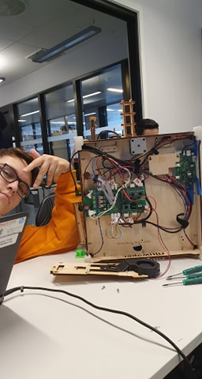

# Yarrbot 3D printer

## Deltaker
- Allenski :)
- Elnar :)
- Marcusb :|
- Ameer :)
- Suri :)

## Status
- Defekt 
	- Må erstatte ødelagte deler
	- Må skaffe manglene deler

## Spesifikasjoner

## Stegmotor (Produktnummer)
- SY42STH38-1684A

### Bevegelsesystem
- Step motorer for x, y og z
- Extruder motor

### Mangende deler
- Hotend
- Extruder
- Bowdentube

### Må fikses
- Mount til extruder motor
- X akse stang
	- Må strammes
- Extruder / Hot end (printer hode)
	
